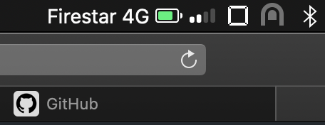

#  TetherStatus

This is an app that shows the battery strength, signal strength and network type of the iPhone tethered to a Mac.

I created this app so users wouldn't have to click on the wireless status bar icon to view the details.

The app uses APIs internal to MacOS which were identified by debugging WiFiAgent and some other inbuilt applications.

## Download

You can download the app here: https://github.com/mvknowles/TetherStatus/releases/download/v1.0/TetherStatus.app.zip
