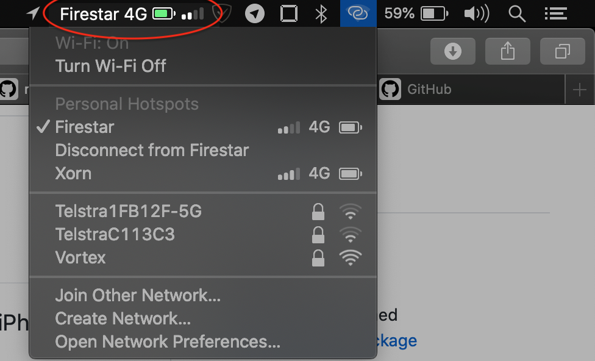

#  TetherStatus

This is an app that shows the battery strength, signal strength and network type of the iPhone tethered to a Mac.

I created this app so users wouldn't have to click on the wireless status bar icon to view the details.

The app uses APIs internal to macOS which were identified by debugging WiFiAgent and some other inbuilt applications. 

## Download

You can download the app here: https://github.com/mvknowles/TetherStatus/releases/download/v1.2/TetherStatus.app.zip

## Hackery
This mini-project was an offshoot of my long-term project, called machowalk: https://github.com/mvknowles/machowalk

Mach-O is the executable & library format used by macOS. machowalk is designed to examine these files in bulk, to make reverse engineering a little-bit less brain-surgery-like.

A lot of the internal details were already available via nm, otool or a good ol' hex editor. I started the above project to create a corpus of all the internal symbols. I'm working on adding details not exposed in the symbol table, by making inferences about types from Core Framework and the Objective-C messaging primitives. 

There's a wealth of information behind the scenes of most macOS apps (particularly in the internal XPC interfaces). Unfortunately, to get extra details via XPC in a manner that is acceptable to the average Joe/Jane, we either need to disable System Integrity Protection (SIP) or have Apple Sign our App (lol). 

If you're interested in behind-the-scenes XPC stuff, let me know. I'm surprised at how little this surface has been explored and enumerated.

## License

Just give me a shout-out, BSD-style if you find this stuff useful.
